# Full Walkthrough — SSH Brute-Force Detection in Splunk

This document covers every step of the project with screenshots as evidence.

---

## Table of Contents

1. [Lab Architecture]
2. [Preparing the Target Machine]
3. [Reconnaissance with Nmap]
4. [Launching the Brute-Force Attack]
5. [Watching auth.log During the Attack]
6. [Confirming Logs Reached Splunk]
7. [Detection Queries in Splunk]
8. [ Suricata IDS]
9. [Dashboard]
10. [Alert Configuration]
11. [Results]

---

## 1. Lab Architecture

The entire lab runs in VirtualBox. All machines are on the same Host-Only network so they can communicate with each other.

```
Kali Linux (192.168.56.20)
        |
        |  SSH brute-force over port 22
        ▼
Ubuntu Server (192.168.56.10)
        |
        |  auth.log → Splunk Universal Forwarder
        ▼
Splunk Enterprise (192.168.56.10:8000)
        |
        |  Dashboards + Alerts
        ▼
     Detection
```

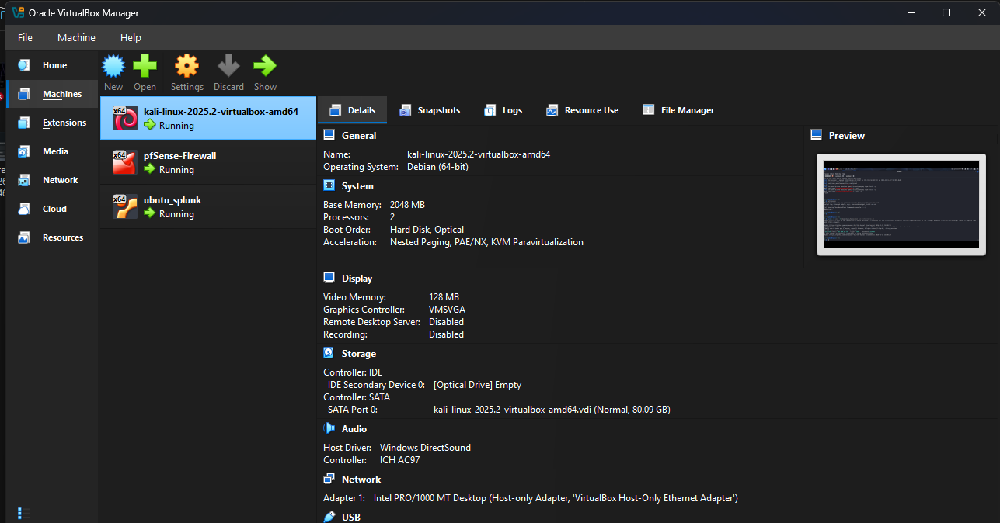

---

## 2. Preparing the Target Machine

SSH was enabled on Ubuntu Server and a test user with a weak password was created for the simulation.

```bash
sudo systemctl start ssh
sudo systemctl enable ssh
sudo adduser lako
# password set to: 123456
```

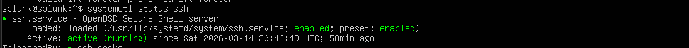


---

## 3. Reconnaissance with Nmap

Before attacking, Nmap was used to confirm SSH was open and running on the target.

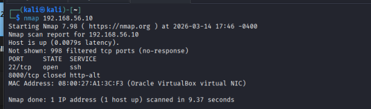

Port 22 confirmed open — SSH version visible. Ready to attack.

---

## 4. Launching the Brute-Force Attack

Two tools were used to simulate the attack from Kali Linux.

### Hydra

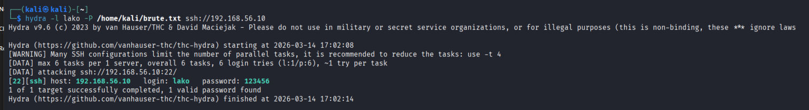

### Metasploit

```
msfconsole

use auxiliary/scanner/ssh/ssh_login
set RHOSTS 192.168.56.10
set USERNAME lako
set PASS_FILE /usr/share/wordlists/rockyou.txt (I used list that was created by me)
set THREADS 5
set VERBOSE true
run
```

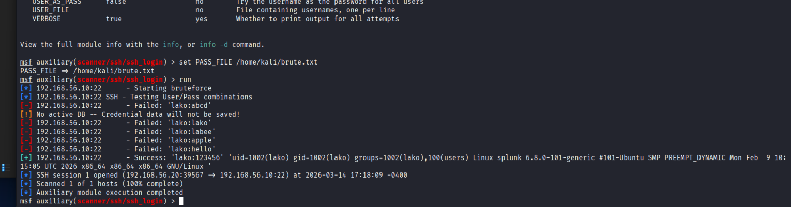

Both tools generated failed login attempts. Metasploit eventually found the correct password.

---

## 5. Watching auth.log During the Attack

While the attack was running, `auth.log` was monitored live on Ubuntu Server.

```bash
sudo tail -f /var/log/auth.log
```

Every failed attempt showed up instantly:


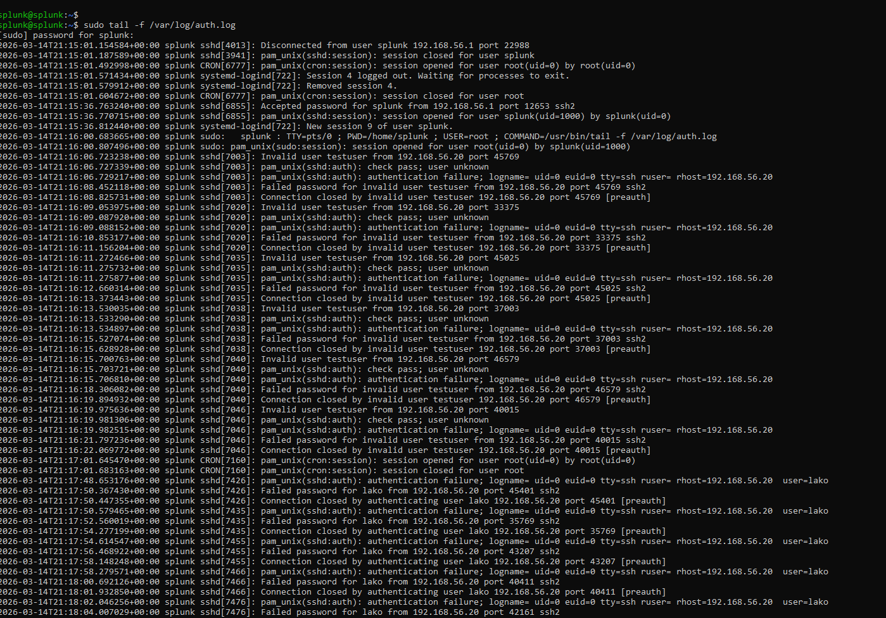

---

## 6. Confirming Logs Reached Splunk

After the forwarder was running, this query confirmed auth.log data was arriving in Splunk:

```spl
index=main sourcetype=linux_secure
```

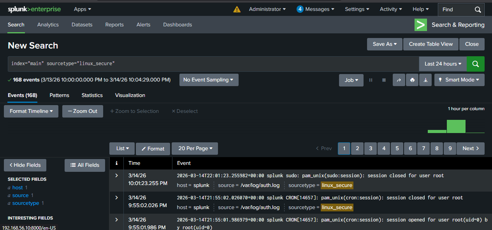

---

## 7. Detection Queries in Splunk

### All Failed SSH Logins

```spl
index=main sourcetype=linux_secure "Failed password"
| rex "from (?<src_ip>\d+\.\d+\.\d+\.\d+)"
| rex "for (?<user>\S+) from"
| table _time, host, src_ip, user
| sort -_time
```

### Top Attacking IPs

```spl
index=main sourcetype=linux_secure "Failed password"
| rex "from (?<src_ip>\d+\.\d+\.\d+\.\d+)"
| stats count as failures by src_ip
| sort -failures
```

### Threshold Detection — Core Alert Query

Any IP that fails more than 10 times in a 5-minute window gets flagged.

```spl
index=main sourcetype=linux_secure "Failed password"
| rex "from (?<src_ip>\d+\.\d+\.\d+\.\d+)"
| bucket _time span=5m
| stats count as failures by src_ip, _time
| where failures > 10
| sort -failures
```

### Breach Indicator — Fail then Succeed

This catches the worst case — an attacker who failed many times and then got in.

```spl
index=main sourcetype=linux_secure ("Failed password" OR "Accepted password")
| rex "from (?<src_ip>\d+\.\d+\.\d+\.\d+)"
| rex "(?<status>Failed|Accepted) password for (?<user>\S+)"
| stats count(eval(status="Failed")) as failures,
        count(eval(status="Accepted")) as successes by src_ip, user
| where failures > 5 AND successes > 0
```

### Attack Timeline

```spl
index=main sourcetype=linux_secure "Failed password"
| timechart span=1m count as "Failed SSH Attempts"
```

---

## 8. Suricata IDS

Suricata was added to monitor network traffic and detect suspicious activity like scans and brute-force attempts.

This complements auth.log by providing network-level visibility.

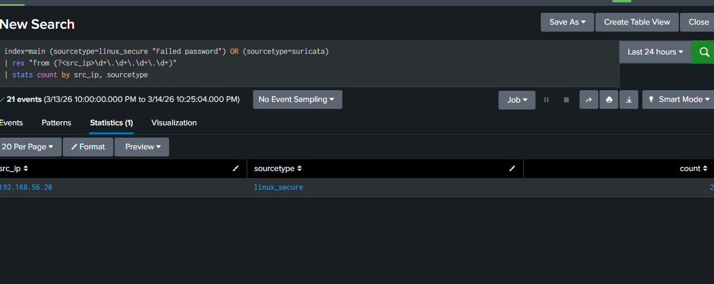

---
## 9. Dashboard

A real-time monitoring dashboard was built in Splunk Dashboard Studio with all detection panels in one view.

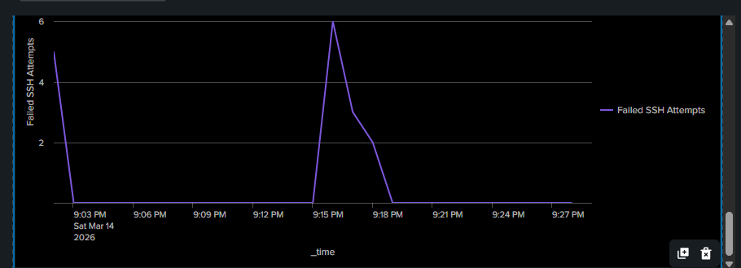
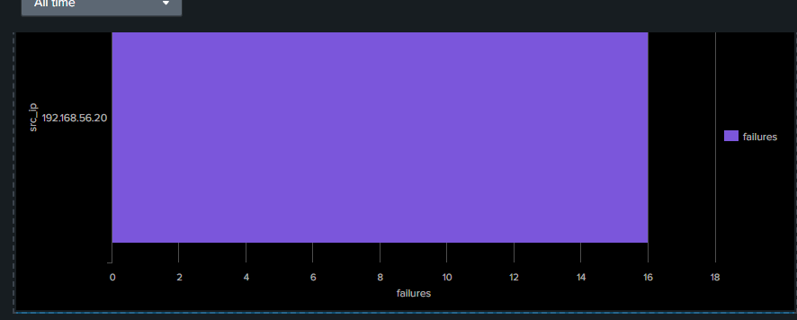
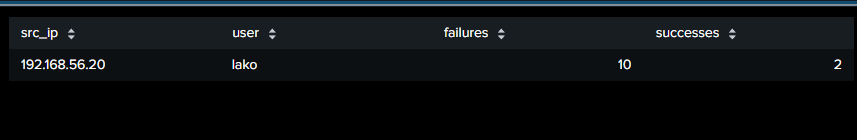
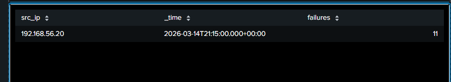
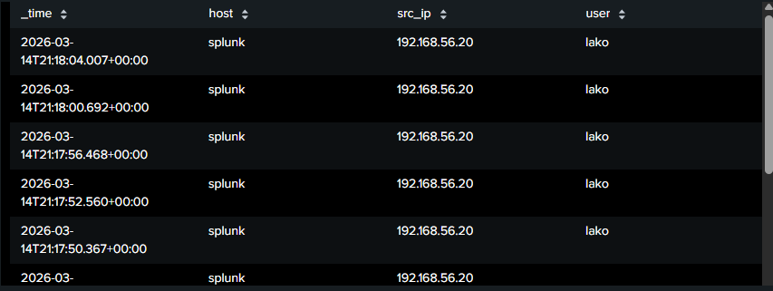

**Panels included:**
- Attack timeline (bar chart showing failed login spikes)
- Top attacking IPs
- Threshold breach table
- Breach detection (fail → success pattern)
- All failed logins event table

---

## 10. Alert Configuration

A scheduled alert was set up to run every 5 minutes based on the threshold query.

**Settings used:**
- Schedule: every 5 minutes
- Trigger condition: number of results > 0
- Action: Add to Triggered Alerts + Log Event

This means the alert fires automatically whenever any IP crosses 10 failures in a 5-minute window — no manual watching needed.

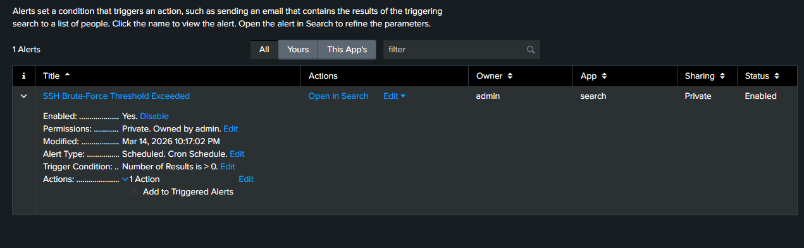

---

## 11. Results

The attack was successfully detected.

| Detail | Value |
|---|---|
| Attacker IP | 192.168.56.20 (Kali Linux) |
| Target account | testuser |
| Failures detected | 11 in one 5-minute window |
| Threshold | 10 failures / 5 minutes |
| Alert fired | Yes |
| Password cracked | Yes (by Metasploit) |
| Breach indicator triggered | Yes |

---

## What I Learned

Setting up the forwarder and getting logs actually flowing into Splunk was the trickiest part — small config mistakes like wrong ports or missing sourcetype values break everything silently. Once the data pipeline was solid, writing the SPL queries felt straightforward.

The breach indicator query (fail then succeed) is the one I found most useful. A basic failed-login count tells you someone is trying. The breach indicator tells you someone got in — which is a completely different level of alert in a real SOC.
